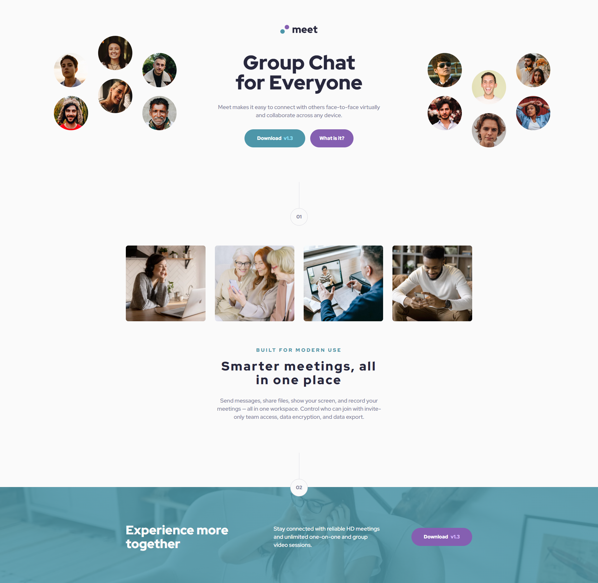

# Frontend Mentor - Meet landing page solution

This is a solution to the [Meet landing page challenge on Frontend Mentor](https://www.frontendmentor.io/challenges/meet-landing-page-rbTDS6OUR). Frontend Mentor challenges help you improve your coding skills by building realistic projects.

## Table of contents

- [Overview](#overview)
  - [The challenge](#the-challenge)
  - [Screenshot](#screenshot)
  - [Links](#links)
- [My process](#my-process)
  - [Built with](#built-with)
  - [What I learned](#what-i-learned)
  - [Continued development](#continued-development)
  - [Useful resources](#useful-resources)
- [Author](#author)
- [Acknowledgments](#acknowledgments)

**Note: Delete this note and update the table of contents based on what sections you keep.**

## Overview

### The challenge

Users should be able to:

- View the optimal layout depending on their device's screen size
- See hover states for interactive elements

### Screenshot

### Links

- Solution URL: [https://github.com/Darko96/meet-landing-page]
- Live Site URL: [https://darko96.github.io/meet-landing-page/]

## My process

### Built with

- Semantic HTML5 markup
- CSS custom properties
- Flexbox
- CSS Grid
- Media queries

### What I learned

I learned more about media queries but for sure I have to learn more about it and ti practice it.

### Continued development

I'll keep practising flexbox, CSS Grid and Media queries.

### Useful resources

- [A Complete Guide to Grid](https://css-tricks.com/snippets/css/complete-guide-grid/) - This helped me a lot ot understand CSS Grid.
- [A Complete Guide to Flexbox](https://css-tricks.com/snippets/css/a-guide-to-flexbox/) - This helped me a lot ot understand flex-box.
- [A Complete Guide to CSS Media Queries](https://css-tricks.com/a-complete-guide-to-css-media-queries/) - This helped me a lot to understand media queries.

## Author

- LinkedIn - [Darko Mijatovic](https://www.linkedin.com/in/darko-mijatovic-512384231/)
- Frontend Mentor - [@Darko96](https://www.frontendmentor.io/profile/Darko96)
- Instagram - [darkomiijatovic](https://www.instagram.com/darkomiijatovic/)

## Acknowledgments

I want to thank a lot to everyone in Frontend Mentor team. Because they made an awesome website where we can practice what we learn.

Thank you so much for checking my project and Any feedback is highly appreciated.
